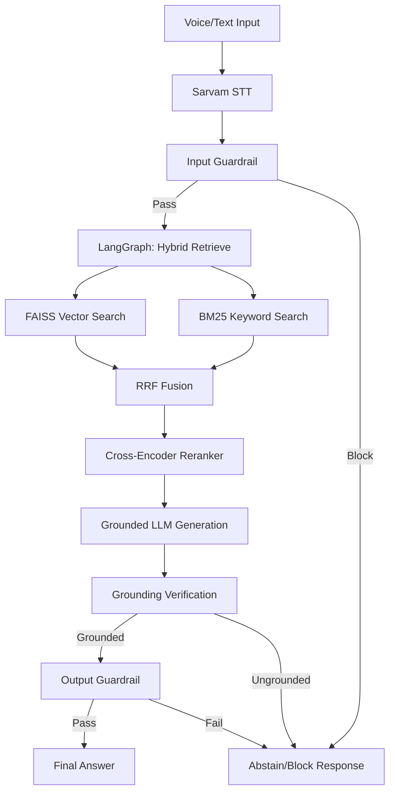

# EchoRAG

**Voice-Enabled Retrieval-Augmented Generation System**  
*HH Goa 2026 Shortlisting Task 2*

EchoRAG is a full-stack, voice-enabled Retrieval-Augmented Generation (RAG) dashboard designed for high-accuracy, grounded question answering. It leverages the official `ai4bharat/MSMARCO-XI` dataset for semantic and keyword retrieval, fused via Reciprocal Rank Fusion (RRF), re-ranked by a Cross-Encoder, and orchestrated through a LangGraph harness with strict input/output guardrails.

---

## 1. Project Overview

EchoRAG operates on a highly structured pipeline:

`Voice Input`  
↓  
`Sarvam Speech-to-Text`  
↓  
`Guardrails (Input Validation)`  
↓  
`LangGraph Harness`  
↓  
`FAISS + BM25 Hybrid Retrieval`  
↓  
`RRF Fusion`  
↓  
`Cross-Encoder Reranking`  
↓  
`Grounded LLM Generation`  
↓  
`Grounding Verification & Output Guardrails`  
↓  
`Final Answer`

---

## 2. Problem Statement
Many RAG systems suffer from hallucinations, poor retrieval precision, or lack native voice integration. EchoRAG solves this by providing a robust, multi-stage pipeline that explicitly verifies grounding, prevents prompt injections, and seamlessly transcribes voice queries using Sarvam AI before processing.

---

## 3. Features
- **Browser-based Voice Recording:** Native MediaRecorder integration with real-time waveform visualization.
- **Hybrid Search Pipeline:** FAISS semantic vector search combined with BM25 keyword search.
- **RRF & Reranking:** Merges results using Reciprocal Rank Fusion and scores them with a HuggingFace Cross-Encoder.
- **Strict Guardrails:** Blocks prompt injections, off-topic queries, and ungrounded hallucinations.
- **Latency Profiling:** Granular performance tracking of every LangGraph node (P50, P70, P100 metrics).
- **Responsive Dashboard:** A premium, dark-mode React interface.

---

## 4. Tech Stack

- **Frontend:** React, Vite, Tailwind CSS, Lucide React
- **Backend:** Python, FastAPI, LangGraph
- **Speech-to-Text:** Sarvam AI
- **Dataset:** `ai4bharat/MSMARCO-XI`
- **Retrieval:** FAISS, Rank-BM25, RRF
- **ML & NLP:** Sentence Transformers (all-MiniLM-L6-v2), Cross-Encoder (ms-marco-MiniLM-L-6-v2)
- **Generation:** Configurable LLM Provider (OpenAI default)

---

## 5. Architecture Diagram



---

## 6. Dataset Processing
This project exclusively uses the official **`ai4bharat/MSMARCO-XI`** dataset from Hugging Face as its knowledge base. It does not use any secondary or external datasets for the core RAG system.

## 7. Chunking Strategy
The offline preprocessing script (`preprocess_msmarco.py`) applies:
- **Semantic splitting:** Recursive character splitting.
- **Fallback overlapping chunks:** To preserve context across boundaries.
- **Deduplication:** Ensures clean indexing.
- **Metadata attachment:** Associates exact document IDs for source citation.

## 8. Retrieval Strategy
We employ a robust **Hybrid Strategy**:
1. **Semantic (FAISS):** Captures intent and meaning.
2. **Keyword (BM25):** Ensures exact terminology matches.
3. **Reciprocal Rank Fusion (RRF):** Mathematically merges ranks from both systems.
4. **Cross-Encoder:** Applies deep attention to the `[Query, Document]` pair to yield the final highly-accurate top-K context.

## 9. LangGraph Harness
The backend orchestration uses `LangGraph` to manage state transitions. The state dictionary strictly tracks the exact pipeline steps, storing validation results, candidates, the generated answer, and high-resolution execution timings. It allows for conditional edges to short-circuit the pipeline if guardrails fail.

## 10. Guardrails
- **Input Validation:** Detects off-topic or malicious prompts.
- **Retrieval Sufficiency:** Abstains if `hybrid_candidates` or `reranked_candidates` are empty.
- **Grounding Verification:** The LLM is forced to verify its own answer against the provided context. If it hallucinated, the system abstains.

## 11. Latency Analytics
EchoRAG includes a reproducible benchmark tool. Run `python scripts/run_benchmark.py` to generate the statistics.
*(Run the benchmark script to generate actual performance results. Percentiles will be visible in the Performance panel.)*

---

## 12. Local Setup

### Frontend
```bash
npm install
npm run dev
```

### Backend
```bash
cd backend
python -m venv .venv
source .venv/bin/activate  # On Windows: .\.venv\Scripts\activate
pip install -r requirements.txt
uvicorn main:app --reload
```

---

## 13. Environment Variables

Create a `.env` in the `backend` directory based on `.env.example`:

| Variable | Description |
|---|---|
| `PORT` | Backend port (default 8000) |
| `ALLOWED_ORIGINS` | Comma-separated CORS origins |
| `LLM_API_KEY` | Provider API Key |
| `LLM_BASE_URL` | Provider Base URL |
| `LLM_MODEL` | Model string (e.g. gpt-4o-mini) |
| `SARVAM_API_KEY` | Sarvam STT Key |

For the frontend, add to `.env.local` or environment config:
`VITE_API_URL=http://localhost:8000`

---

## 14. Dataset Preprocessing & 15. Index Building
To prepare the MSMARCO-XI dataset and build the FAISS/BM25 indices locally (Warning: Requires significant RAM):
```bash
cd backend
python scripts/preprocess_msmarco.py
python scripts/build_index.py
```

## 16. Running Benchmarks
To run the latency suite and calculate P50/P70/P100 metrics:
```bash
cd backend
python scripts/run_benchmark.py
```

## 17. Running the Application
Ensure the backend is running (`uvicorn main:app`) and the frontend is running (`npm run dev`). Open `http://localhost:5173`.

---

## 18. Deployment Architecture
Due to Vercel Serverless Function bundle limits (250MB) and the massive size of the Python ML dependencies (PyTorch, FAISS, Sentence-Transformers), EchoRAG uses a **Split Deployment Architecture**:
- **Frontend:** Vercel (Fast SPA delivery).
- **Backend:** Stateful container hosting (e.g., Render, Railway, AWS) to support the ~1.2GB ML environment and persistent index artifacts.

## 19. Live Demo
- **Frontend URL:** *(Deployment pending configuration)*
- **Backend URL:** *(Deployment pending configuration)*

## 20. Limitations and Future Improvements
- **Index Size:** FAISS and BM25 loaded in memory consume significant RAM. Future improvements could involve migrating to a hosted vector database (e.g., Pinecone, Qdrant) and a dedicated text search engine (e.g., Elasticsearch).
- **Cold Starts:** When deployed in serverless environments, loading the Cross-Encoder and FAISS index introduces latency.
- **External Latency:** Overall generation speed relies heavily on the response times of the Sarvam STT and LLM APIs.
